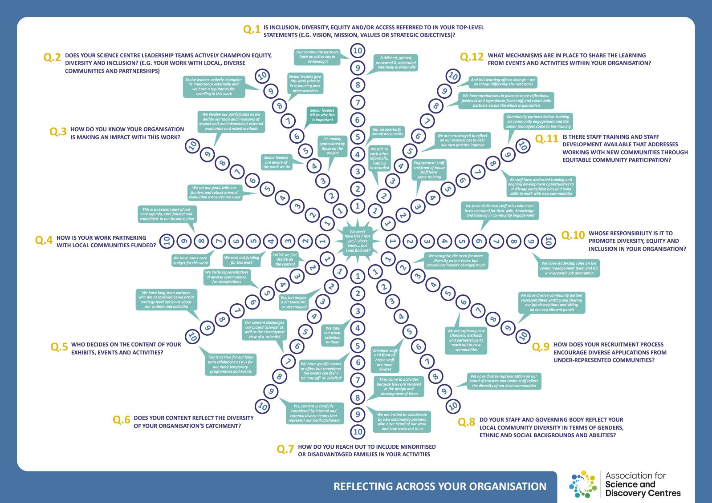

# The Inclusion Wheel

The Inclusion Wheel was developed by the Association for Science and Discovery Centres in the UK as an accessible tool for science centre practitioners to use for internal reflection about their organisation and how it is structured, and discussion of how it might be changed.

This tool addresses elements of inclusion across different areas of an organisation including; leadership & strategy, evaluation, content, partnerships, staff diversity, training and accessibility.

SOURCE: [https://inclusion.sciencecentres.org.uk/evaluating-inclusion/practical-creative-tools/inclusionreflection-wheel/](https://inclusion.sciencecentres.org.uk/evaluating-inclusion/practical-creative-tools/inclusionreflection-wheel/)

<figure><figcaption></figcaption></figure>

**The Inclusion Wheel for Organisational Reflection**

* [ASDC Inclusion Wheel (English) (PDF, 957.9kB)](https://inclusion.sciencecentres.org.uk/documents/37/ASDC_Inclusion_wheel.pdf)
* [ASDC Inclusion Wheel (Deutsch) (PDF, 946.3kB)](https://inclusion.sciencecentres.org.uk/documents/35/ASDC_Inclusion_wheel_German.pdf)
* [ASDC Inclusion Wheel (Dutch) (PDF, 1013.0kB)](https://inclusion.sciencecentres.org.uk/documents/38/ASDC_Inclusion_wheel_Dutch.pdf)
* [ASDC Inclusion Wheel (Português) (PDF, 961.0kB)](https://inclusion.sciencecentres.org.uk/documents/36/ASDC_Inclusion_wheel_Portuguese.pdf)
