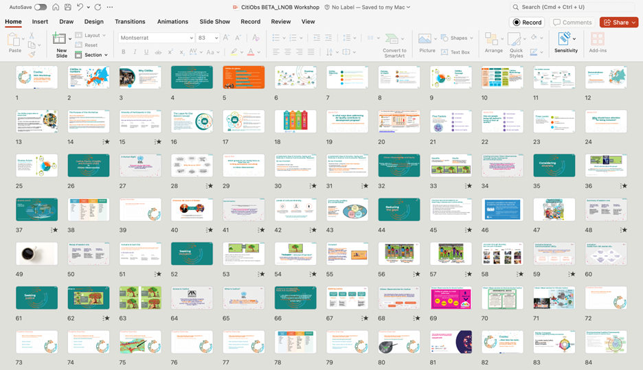

# LNOB Workshop Slide Deck

The CitiObs LNOB Workshop materials introducing the pledge to "Leave No One Behind' and the concepts of Justice, Equity, Diversity and Inclusion (JEDI)  take the form of a slide presentation, along with interactivity materials, and guidance for the use of both with key stakeholders at different stages of the CO lifecycle.

As we develop this slide deck, we have been creating made-to-measure versions for workshops with our Frontrunner Cases, to test their contents in our own reflections sessions.&#x20;

These interim versions can be found in the CitiObs Zenodo repository:

* [The LNOB workshop with the Dublin-based front runner cases](https://zenodo.org/records/13919897) - October 2024
* [The LNOB workshop at the SciVil citizen science network day](https://zenodo.org/records/13896021) - October 2024
* [The LNOB mentoring workshop with front-runner cases](https://zenodo.org/records/17680335) - June 2025

The final version of these slides will be uploaded to Zenodo and contained in the LNOB Toolkit and CitiObs Cookbook.

<figure><figcaption>
Slidedeck of the LNOB workshop
</figcaption></figure>

