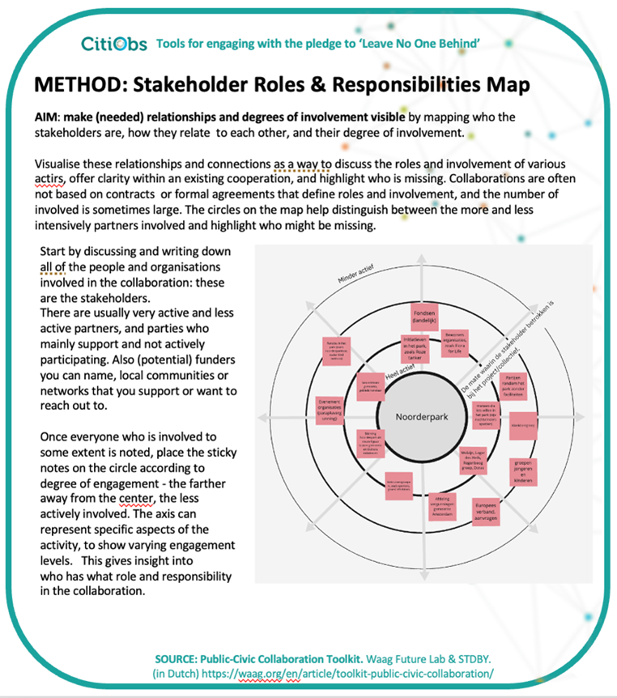
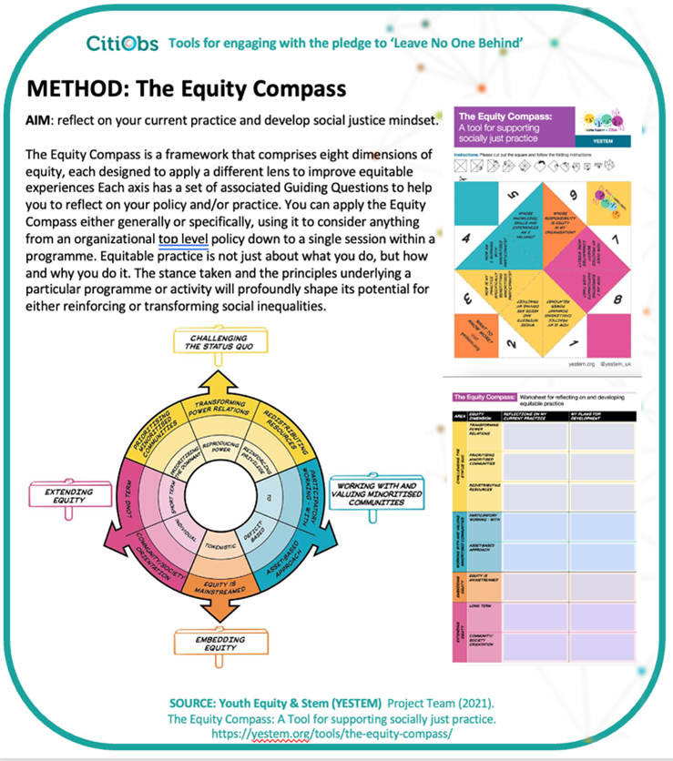

# ...by consideration of Roles and Inequities

## The Stakeholder Roles & Responsibilities Map

The aim of this method, developed by Waag Future Lab and the Citizen Science Lab at Leiden University, is to make (needed) relationships and degrees of involvement visible by mapping who the stakeholders are, how they relate to each other, and their degree of involvement.

<figure><figcaption></figcaption></figure>

The method guides you through visualising these relationships and connections as a way to discuss the roles and involvement of various actors, which helps offer clarity within an existing cooperation, and highlight who is missing. Collaborations are often not based on contracts or formal agreements that define roles and involvement, and the number of involved is sometimes large. The circles on the map help distinguish between the more and less intensively partners involved and highlight who might be missing. (**Source**: (in Dutch) [https://waag.org/en/article/toolkit-public-civic-collaboration/](https://waag.org/en/article/toolkit-public-civic-collaboration/))

## The Equity Compass

<figure><figcaption></figcaption></figure>

The Equity Compass developed by the Youth Equity & Stem project (YESTEM) is a framework that aids reflection on the ethics of your current practice and helps develop social justice mindset. It comprises eight dimensions of equity, each designed to apply a different lens to improve equitable experiences. Each axis has a set of associated Guiding Questions to help you to reflect on your policy and/or practice. You can apply the Equity Compass either generally or specifically, using it to consider anything from an organizational top level policy down to a single session within a programme. (**Source:** [https://yestem.org/tools/the-equity-compass](https://yestem.org/tools/the-equity-compass) ).
