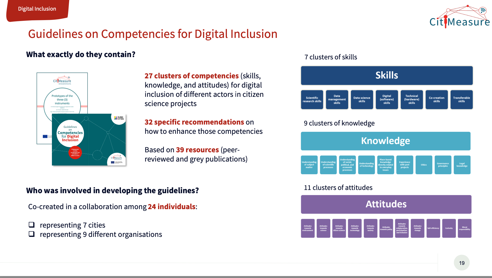

# CitiMeasure Guidelines on Competencies for Digital Inclusion

The Guidelines on Competencies for Digital Inclusion were developed through a co-creation process led by Eurocities in the EU-funded [CitiMeasure project,](https://citimeasure.eu/) drawing on the collective experience and expertise of 24 working group members from 7 European cities and 9 organisations. The guidelines use competencies — understood as a combination of skills, knowledge, and attitude — as a lens for exploring what digital inclusion means in practice in citizen science, both for the citizens who participate and for the project leaders and facilitators who design and run initiatives.

The guidelines identify seven categories of skills relevant to digital inclusion in citizen science, ranging from scientific research and data management skills through to co-creation, digital, and transferable skills such as critical thinking, communication, and the ability to build trust. Nine categories of knowledge are described — from understanding of subject matter and scientific processes to place-based and indigenous knowledge, governance principles, and legal knowledge. Eleven categories of attitude are also identified, covering attitudes towards science, technology, collaboration, change, and moral responsibility, among others.

<figure><figcaption></figcaption></figure>

The guidelines close with a set of practical recommendations for all actors involved in citizen science initiatives. These include: understanding the social, cultural, economic, and political context before choosing technologies; investing time in the planning phase to identify necessary skills and address privacy and ethical concerns from the outset; embedding inclusive thinking into both project and technology design, with active attention to marginalised groups; adopting co-creative and participatory design approaches; helping participants overcome technical challenges through accessible training and support; recognising participants' contributions; being aware of biases in self-reported skills; and actively fostering the value of citizen science through communication and knowledge-sharing strategies.

SOURCE: Gharesifard, M., Vivas Lalinde, I. et al. (2022). _CitiMeasure Guidelines on Competencies for Digital Inclusion_. Eurocities / CitiMeasure. EU Technical Support Instrument, Grant Agreement 101046124.

**CitiMeasure Digital Inclusion Guidelines — Download**

* [Download the guidelines (PDF)](https://www.citimeasure.eu/wp-content/uploads/2022/10/CitiMeasure-Digital-Inclusion-instrument-v1_2-FINAL.pdf)
* [CitiMeasure project website](https://www.citimeasure.eu/)
