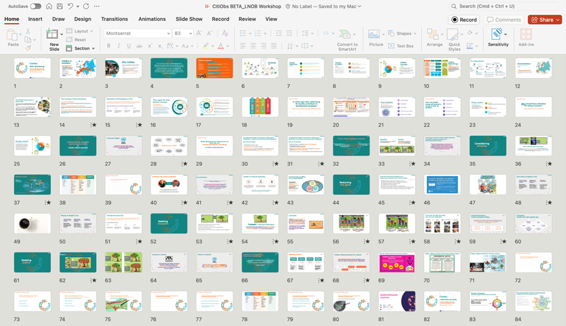

# LNOB Workshop Slide Deck

The CitiObs LNOB Workshop materials introducing the pledge to "Leave No One Behind' and the concepts of Justice, Equity, Diversity and Inclusion (JEDI)  take the form of a slide presentation, along with interactivity materials, and guidance for the use of both with key stakeholders at different stages of the CO lifecycle.

The current version of the workshop contains 84 slides to help people understand and engage with the concepts of Justice, Equity, Diversity, Inclusion, and ‘Leaving No One Behind’. These are not yet shared online to maintain version control, but are being shared with the Frontrunner Cases during the testing phase. The final version of these slides will be uploaded to Zenodo and contained in the LNOB Toolkit and CitiObs Cookbook.

<figure><figcaption>
Slidedeck of the LNOB workshop
</figcaption></figure>

