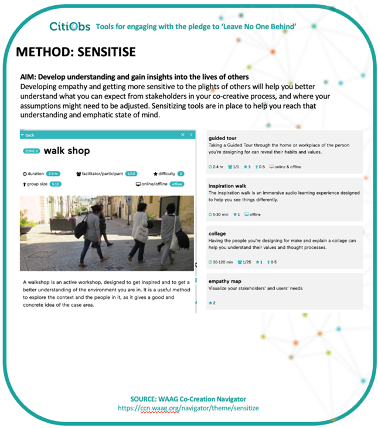
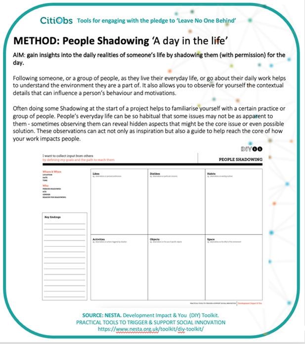
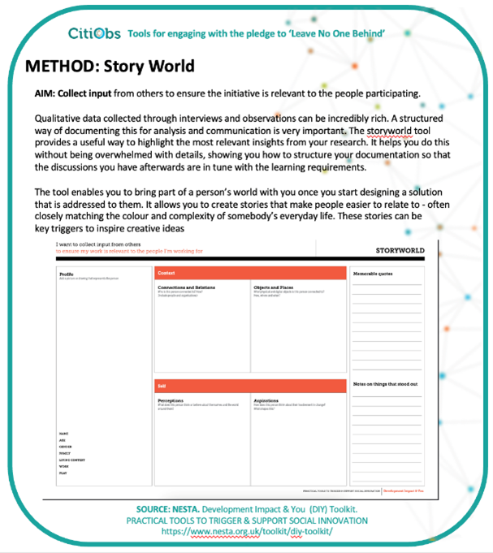
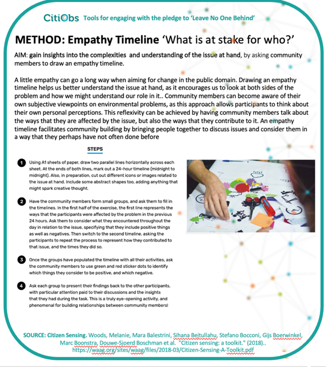
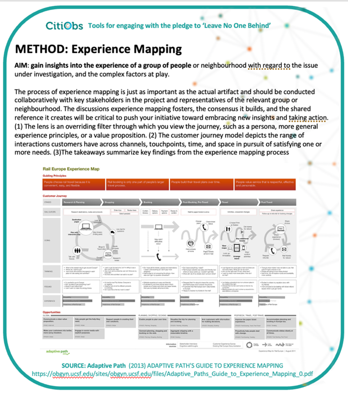

# Consideration for Lived Experience and Living Environment

The 'Sensitise' collection of methods in the Waag Co-Creation Navigator

The aim of this collection is to develop empathy and understanding by gaining insights into the lives and contexts of others, to help you better understand the context of your participants and/or stakeholders before embarking on a co-creative process. It invites you to observe physical surroundings and consider whether and where your assumptions might need to be adjusted. Curated, tested, and further-developed by the Waag Smart Citizen Lab for inclusion in the Citizen Sensing Toolkit and online Co-Creation Navigator their objective is to help citizen science initiatives and citizen observatories gain a better understanding of the issues faced by their participants, local partners and stakeholders in the aims of the initiative, and how any barriers to participation might be removed.

<figure><figcaption></figcaption></figure>

Within this collection, the **Walk Shop Method** invites you to explore the context of a neighbourhood and the people in it, by taking a walk around it in a deliberate and observant fashion, to gain a better concrete idea of the case area. The **Photo Safari Method** is based on the principle of ‘shadowing’ by joining someone, or a group of people, as they live their everyday life, or go about their daily work to better understand the environment they are part of. Literally taking photos is optional, but recording your observations will allow you to capture the contextual details that can influence a person’s behaviour and motivations. The **Guided Tour Method** gathers insights by asking a participant or community member to give you a Guided Tour of their home, workplace, or daily activities to not only reveal the physical details of the person’s life, but also their routines, habits and interactions with their environment and context. (**Source:** [https://ccn.waag.org/navigator/theme/sensitize](https://ccn.waag.org/navigator/theme/sensitize))

## The Shadowing Method Template

<figure><figcaption></figcaption></figure>

The Shadowing Method developed by NESTA and contained in their Development Impact & You (DIY) Toolkit aims to gain insights into the daily realities of someone’s life by shadowing them (with permission) for the day. It is the same basic principle as the methods described in the Waag Co-Creation Navigator above, but also provides a useful template for capturing observations about the daily work, environment and contextual details of the person you are shadowing. Doing some shadowing at the start of a project can help you to familiarise yourself with a certain practice or group of people. People’s everyday life can be so habitual that some issues may not be as apparent to them - sometimes observing them can reveal hidden aspects that might be the core issue or even possible solution. These observations can act not only as inspiration but also a guide to help reach the core of how your work impacts people. (**Source:** [https://www.nesta.org.uk/toolkit/diy-toolkit](https://www.nesta.org.uk/toolkit/diy-toolkit))

## The Story World Method Template

<figure><figcaption></figcaption></figure>

The Story World Method developed by NESTA that is also contained in their Development Impact & You (DIY) Toolkit aims to gather insights from participants and community members along with qualitative data collected through interviews and observations. It is similar to the Guided Tour method described in the Waag Co-Creation Navigator collection, but also provides a useful template for documenting insights in a structured way, and highlighting the most relevant ones for the activities of the CO. It helps you do this without being overwhelmed with details, showing you how to structure your documentation so that the discussions you have afterwards are in tune with further co-creation activities. The tool enables you to bring part of a person’s world with you once you start designing the activities of the CO and allows you to create stories that make people easier to relate to. (**Source:** [https://www.nesta.org.uk/toolkit/diy-toolkit](https://www.nesta.org.uk/toolkit/diy-toolkit))

## The Empathy Timeline Method

Also developed by Waag Smart Citizen Lab for the Citizen Sensing Toolkit, the aim of the Empathy Timeline method is to gain insights into the complexities of the issue at hand by asking community members to collaboratively draw an empathy timeline.

<figure><figcaption></figcaption></figure>

Drawing an empathy timeline helps stakeholders to better understand each other and to look at different sides of the problem and how it is experienced. Using this method helps community members to become aware of their own subjective viewpoints on environmental problems, to think about their own personal perceptions, and to consider what their own role in the issue might be. This reflexivity can be achieved by having community members talk about the ways that they are affected by the issue, but also the ways that they contribute to it. An empathy timeline facilitates community building by bringing people together to discuss issues and consider them in a way that they perhaps have not often done before. (**Source:** [https://waag.org/sites/waag/files/2018-03/Citizen-Sensing-A-Toolkit.pdf](https://waag.org/sites/waag/files/2018-03/Citizen-Sensing-A-Toolkit.pdf))

## The Experience Mapping Method

<figure><figcaption></figcaption></figure>

This method developed by Adaptive Path aims to gain insights into the experience of a group of people or neighbourhood regarding the issue under investigation, and the complex factors at play. The process of experience mapping is just as important as the outcome and should be conducted collaboratively with key stakeholders in the project and representatives of the relevant group or neighbourhood.

The discussions experience mapping fosters, the consensus it builds, and the shared reference it creates will be critical to push your initiative toward embracing new insights and taking action: The method incorporates three main components: (1) 'The lens' is an overriding filter through which you view the journey, such as a persona, more general experience principles, or a value proposition, (2) 'The customer journey model' depicts the range of interactions customers have across channels, touchpoints, time, and space in pursuit of satisfying one or more needs, and (3)'The takeaways' summarize key findings from the experience mapping process. (**Source:** [https://obgyn.ucsf.edu/sites/obgyn.ucsf.edu/files/Adaptive\_Paths\_Guide\_to\_Experience\_Mapping\_0.pdf](https://obgyn.ucsf.edu/sites/obgyn.ucsf.edu/files/Adaptive_Paths_Guide_to_Experience_Mapping_0.pdf))
