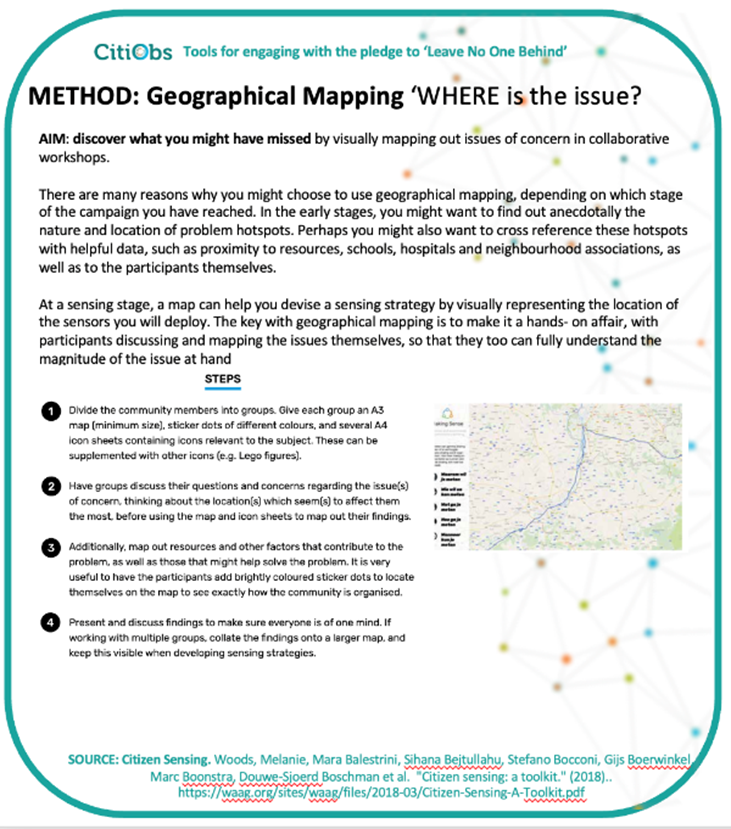
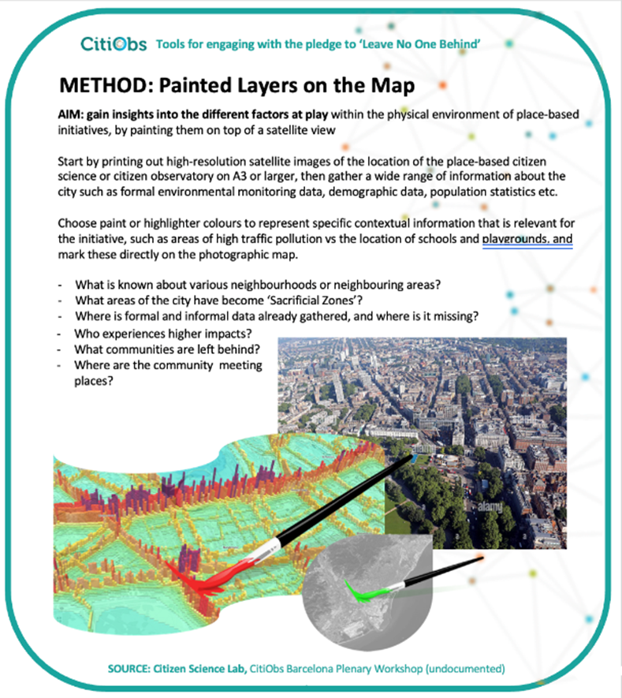

# Consideration of the Geographical Context

## The Geographical Mapping Method

<figure><figcaption></figcaption></figure>

The aim of this method contained in the Citizen Sensing Toolkit is to gain new insights about the location and geographical context of a citizen science initiative or citizen observatory by visually mapping out issues of concern in collaborative workshops.

In the early stages of an initiative this method helps identify the nature and location of problem hotspots, which can then be cross-referenced with helpful data, such as proximity to resources, schools, hospitals and neighbourhood associations, as well as to the participants themselves.

At the stage of initiating monitoring activities, the collaboratively created map can help devise a sensing strategy by visually representing the location of the sensors to be deployed or measurement activities to coordinate. The key with geographical mapping is to make it a hands- on affair, with a diverse range of participants and stakeholders discussing and mapping the issues themselves, so that they too can highlight issues and concerns, while also coming to a more complete picture of the issue at hand. (**Source:** [https://waag.org/sites/waag/files/2018-03/Citizen-Sensing-A-Toolkit.pdf](https://waag.org/sites/waag/files/2018-03/Citizen-Sensing-A-Toolkit.pdf))

## The Painted Layers on the Map Method

<figure><figcaption></figcaption></figure>

The aim of this method, developed by the Citizen Science Lab at Leiden University for the CitiObs project, is to gain insights into the different factors at playwithin the physical environment of place-based initiatives, by drawing, marking or painting them on a map of the city. After printing out a high-resolution satellite images of the location of the place-based citizen science or citizen observatory on A3 or larger, gather a wide range of information about the city such as formal environmental monitoring data, demographic data, population statistics etc, and also provide this in visible form (printed or otherwise). Choose paint or highlighter colours to represent specific contextual information that is relevant for the initiative, such as areas of high traffic pollution vs the location of schools and playgrounds, mark these directly on the map, and consider questions such as:

* What is known about various neighbourhoods or neighbouring areas?
* What areas of the city have become ‘Sacrificial Zones’?
* Where is formal and informal data already gathered, and where is it missing?
* Who experiences higher impacts?
* What communities are left behind?
* Where are the community meeting places.
